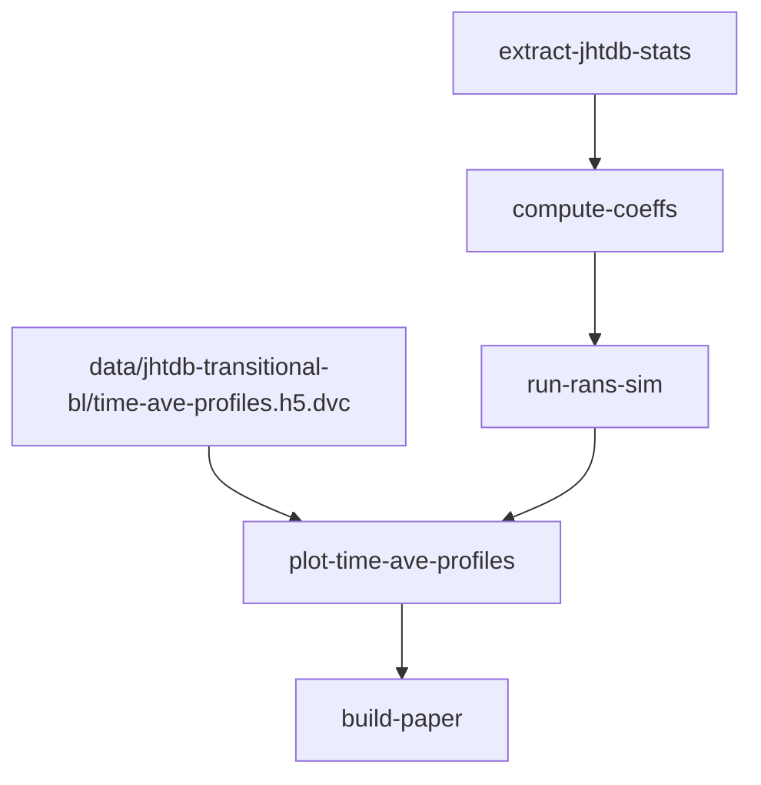

# Boundary layer turbulence modeling

Attempting to generate and validate
a new turbulence model from boundary layer DNS.

## Questions

1. This is the first question.
2. This is the second question.

This is an unordered list:
* This is an unordered list item.
* This is another.

## Workflow

